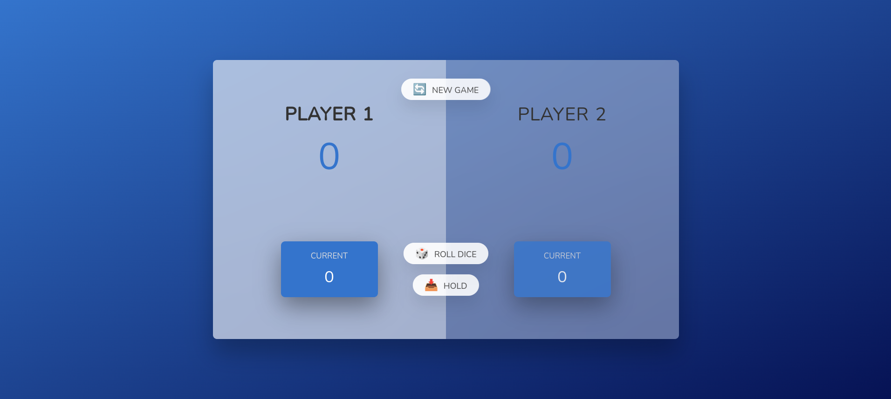
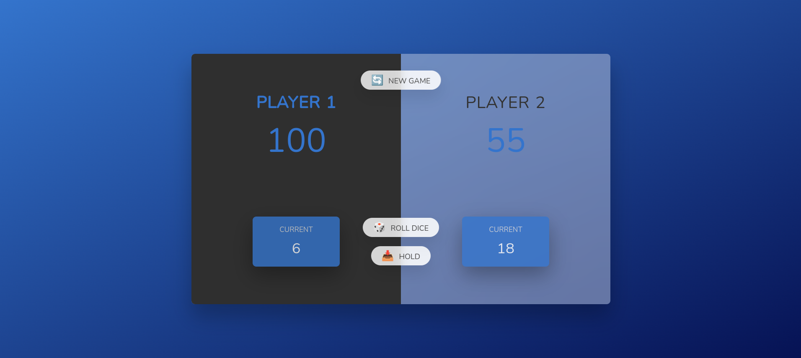

# Rolling the Dice

### This repo contains a small JavaScript-Game that I built on my journey of learning how to program an Application with JavaScript and algortihm thinking works

## Who gets 100 Points first?

**The goal is to be the first to roll a total of 100 points.**

**Everytime you click on "ROLL THE DICE" you will roll a new dice between 1 and 6. The rolled dices will be contained as your current score and you can click on "HOLD" to transfer the current score into your total amount. The tricky part of this game is that you are not allowed to roll a 1, because in that case your current score will be automatically resetted to 0 and your turn will be ended without any add of your current score into the total amount.**

## The first player with a total score of 100 points or more will be displayed as the Winner!

### You can start a new game by clicking on the "NEW GAME" Button so all points will be resetted to the default start.

